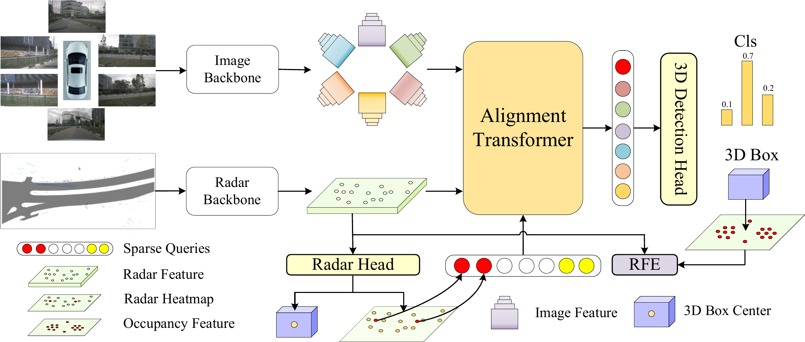

<div align="center">
<h1>RCAlign</h1>
<h3>RCAlign: Revisiting Radar Camera Alignment by Contrastive Learning for 3D Object Detection</h3>
</div>

<p align="center">
  <a href="https://ieeexplore.ieee.org/abstract/document/11523464">
    
  </a>
</p>

<p align="center">
  
  
</p>

## Introduction

This repository is an official implementation of RCAlign.


## Environment Setup

```shell
conda create -n rcalign python=3.8
conda activate rcalign
pip install torch==1.10.0+cu111 torchvision==0.11.0+cu111 torchaudio==0.10.0 -f https://download.pytorch.org/whl/torch_stable.html

#flash-attn
pip install flash-attn==0.2.2

# mmdet3d
pip install mmcv-full==1.5.3
pip install mmdet==2.28.2
pip install mmsegmentation==0.30.0
cd ./RCAlign
git clone https://github.com/open-mmlab/mmdetection3d.git
cd mmdetection3d
git checkout v1.0.0rc6 
pip install -e .
```

## Data Preparation
1. Download the [nuScenes dataset](https://www.nuscenes.org/download) to `./data/nuscenes`.
2. Generate the info files from [RCAlign info file](https://drive.google.com/drive/folders/11Izhf4ENwy6x-0FbCflqVMTgwjJSpbsZ?usp=sharing) or use the shell.
```shell
python tools/create_data_nusc.py --root-path ./data/nuscenes --out-dir ./data/nuscenes --extra-tag nuscenes --version v1.0
```

Folder structure
```
RCAlign
├── projects/
├── mmdetection3d/
├── tools/
├── configs/
├── ckpts/
├── data/
│   ├── nuscenes/
│   │   ├── maps/
│   │   ├── samples/
│   │   ├── sweeps/
│   │   ├── v1.0-test/
|   |   ├── v1.0-trainval/
|   |   ├── nuscenes_infos_train.pkl
|   |   ├── nuscenes_infos_val.pkl
```

## Training and Inference
```shell
#train
bash tools/dist_train.sh projects/configs/RCAlign/rcalign_r50_radar_deform_704_bs4_seq_60e.py 4 --work-dir work_dirs/rcalign_r50_radar_deform_704_bs4_seq_60e

#val
bash tools/dist_test.sh projects/configs/RCAlign/rcalign_r50_radar_deform_704_bs4_seq_60e.py work_dirs/rcalign_r50_radar_deform_704_bs4_seq_60e/latest.pth 4 --eval bbox
```

## Results on NuScenes Val Set.
The ResNet50 backbone configuration can be found in [config](projects/configs/RCAlign/rcalign_r50_radar_deform_704_bs4_seq_60e.py), and the pretrained model is available at [model](https://drive.google.com/file/d/1FU8hcVbHMC6rDl1FJk0dQIzYwUmILh6z/view?usp=sharing).

|  Model  | Backbone  | NDS  | mAP  |
|:-------:|:---------:|:----:|:----:|
| RCAlign | ResNet50  | 61.1 | 53.7 |    
| RCAlign | ResNet101 | 64.5 | 57.0 |


## Results on NuScenes Test Set.
| Model | Backbone | NDS  | mAP  |
| :---: | :---:  |:----:|:----:|
|RCAlign| V2-99  | 67.3 | 60.6 |


## Acknowledgements

We thank these great works and open-source codebases: [MMDetection3d](https://github.com/open-mmlab/mmdetection3d), [StreamPETR](https://github.com/exiawsh/StreamPETR/tree/main).


## Citation

If you find RCAlign is useful in your research or applications, please consider giving us a star 🌟 and citing it by the following BibTeX entry.
```bibtex
@article{kong2026rcalign,
  title={RCAlign: Revisiting Radar Camera Alignment by Contrastive Learning for 3D Object Detection},
  author={Kong, Linhua and Chang, Dongxia and Liu, Lian and Kong, Zisen and Li, Pengyuan and Zhao, Yao},
  journal={IEEE Transactions on Circuits and Systems for Video Technology},
  year={2026},
  publisher={IEEE}
}
```
